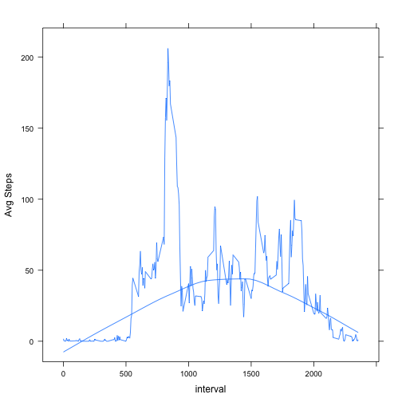

# Reproducible Research: Peer Assessment 1


## Loading and preprocessing the data


```r
# Load Data if file exists else download and unzip data file 

if(!file.exists("data/activity.csv"))
{
  if (file.exists("activity.zip"))
  {
    unzip("activity.zip", exdir = "data")
  }
  else
  {
    print("Error : activity.zip file not found")
    cat("Download file [Y/N] ")
    response<-scan(n=1,what=character())
    if(response =="Y" || response=="y")
    {
     download.file("https://d396qusza40orc.cloudfront.net/repdata%2Fdata%2Factivity.zip",destfile="activity.zip",method="curl")
     unzip("activity.zip", exdir = "data")
    }
    else
     { print("Script terminated")}
  } 
}
```
###Load Activity Data ###
  
  - With missiing values to adata
  
  - Tidy data values to atidydata
  

```r
# Load activity data into adata

adata<-read.csv("./data/activity.csv")
atidydata<-read.csv("./data/activity.csv",na.strings=c("NA","NULL"))
atidydata$ts<-as.POSIXct(as.double(atidydata$interval),origin=atidydata$date)
```

###Column Attributes###


```r
# Print variable names
names(adata)
```

```
## [1] "steps"    "date"     "interval"
```

###Summary###

```r
# Display summary
summary(adata)
```

```
##      steps               date          interval   
##  Min.   :  0.0   2012-10-01:  288   Min.   :   0  
##  1st Qu.:  0.0   2012-10-02:  288   1st Qu.: 589  
##  Median :  0.0   2012-10-03:  288   Median :1178  
##  Mean   : 37.4   2012-10-04:  288   Mean   :1178  
##  3rd Qu.: 12.0   2012-10-05:  288   3rd Qu.:1766  
##  Max.   :806.0   2012-10-06:  288   Max.   :2355  
##  NA's   :2304    (Other)   :15840
```

### Process/Transform ###


```r
#ensure data types

class(adata$steps)
```

```
## [1] "integer"
```

```r
class(adata$date)
```

```
## [1] "factor"
```

```r
class(adata$interval)
```

```
## [1] "integer"
```

## What is mean total number of steps taken per day?

### Mean total number of steps taken per slot and per day###
1. Make a histogram of the total number of steps taken each day

```r
#Calculate mean
library(plyr)
adatadaywise<-ddply(atidydata,~date,summarise,total=sum(steps),mean=mean(steps),median=median(steps),max=max(steps),lowest=min(steps))
atid<-ddply(atidydata,~interval,summarise,meanStep=mean(steps,na.rm=T))

#draw histrogram of steps per slot and per day side by side  
#par(mfrow=c(1,2))
hist(adata$steps,xlab="Total steps per slot",main="Histrogram of Total number of steps taken per slot")
```

 

```r
hist(adatadaywise$total,xlab="Total steps per day",main="Histogram of Total Number of Steps taken each day")
```

 

###Mean and Median###
2. Calculate and report the mean and median total number of steps taken per day


```r
#display total and mean steps on each day of slots
###Total Steps,Mean(slots/day), Max and Lowest###
adatadaywise[,c("date","total","mean","median","max","lowest")]
```

```
##          date total    mean median max lowest
## 1  2012-10-01    NA      NA     NA  NA     NA
## 2  2012-10-02   126  0.4375      0 117      0
## 3  2012-10-03 11352 39.4167      0 613      0
## 4  2012-10-04 12116 42.0694      0 547      0
## 5  2012-10-05 13294 46.1597      0 555      0
## 6  2012-10-06 15420 53.5417      0 526      0
## 7  2012-10-07 11015 38.2465      0 523      0
## 8  2012-10-08    NA      NA     NA  NA     NA
## 9  2012-10-09 12811 44.4826      0 748      0
## 10 2012-10-10  9900 34.3750      0 413      0
## 11 2012-10-11 10304 35.7778      0 748      0
## 12 2012-10-12 17382 60.3542      0 802      0
## 13 2012-10-13 12426 43.1458      0 542      0
## 14 2012-10-14 15098 52.4236      0 540      0
## 15 2012-10-15 10139 35.2049      0 786      0
## 16 2012-10-16 15084 52.3750      0 758      0
## 17 2012-10-17 13452 46.7083      0 744      0
## 18 2012-10-18 10056 34.9167      0 759      0
## 19 2012-10-19 11829 41.0729      0 512      0
## 20 2012-10-20 10395 36.0938      0 532      0
## 21 2012-10-21  8821 30.6285      0 501      0
## 22 2012-10-22 13460 46.7361      0 783      0
## 23 2012-10-23  8918 30.9653      0 499      0
## 24 2012-10-24  8355 29.0104      0 533      0
## 25 2012-10-25  2492  8.6528      0 443      0
## 26 2012-10-26  6778 23.5347      0 440      0
## 27 2012-10-27 10119 35.1354      0 555      0
## 28 2012-10-28 11458 39.7847      0 533      0
## 29 2012-10-29  5018 17.4236      0 591      0
## 30 2012-10-30  9819 34.0938      0 523      0
## 31 2012-10-31 15414 53.5208      0 757      0
## 32 2012-11-01    NA      NA     NA  NA     NA
## 33 2012-11-02 10600 36.8056      0 753      0
## 34 2012-11-03 10571 36.7049      0 533      0
## 35 2012-11-04    NA      NA     NA  NA     NA
## 36 2012-11-05 10439 36.2465      0 785      0
## 37 2012-11-06  8334 28.9375      0 630      0
## 38 2012-11-07 12883 44.7326      0 766      0
## 39 2012-11-08  3219 11.1771      0 359      0
## 40 2012-11-09    NA      NA     NA  NA     NA
## 41 2012-11-10    NA      NA     NA  NA     NA
## 42 2012-11-11 12608 43.7778      0 540      0
## 43 2012-11-12 10765 37.3785      0 542      0
## 44 2012-11-13  7336 25.4722      0 444      0
## 45 2012-11-14    NA      NA     NA  NA     NA
## 46 2012-11-15    41  0.1424      0  33      0
## 47 2012-11-16  5441 18.8924      0 475      0
## 48 2012-11-17 14339 49.7882      0 753      0
## 49 2012-11-18 15110 52.4653      0 785      0
## 50 2012-11-19  8841 30.6979      0 789      0
## 51 2012-11-20  4472 15.5278      0 500      0
## 52 2012-11-21 12787 44.3993      0 758      0
## 53 2012-11-22 20427 70.9271      0 567      0
## 54 2012-11-23 21194 73.5903      0 760      0
## 55 2012-11-24 14478 50.2708      0 785      0
## 56 2012-11-25 11834 41.0903      0 551      0
## 57 2012-11-26 11162 38.7569      0 709      0
## 58 2012-11-27 13646 47.3819      0 806      0
## 59 2012-11-28 10183 35.3576      0 733      0
## 60 2012-11-29  7047 24.4688      0 568      0
## 61 2012-11-30    NA      NA     NA  NA     NA
```

```r
adaysummary<-ddply(adatadaywise,~date,summarise,meanSteps=mean(total,na.rm=T),medianSteps=median(total,na.rm=T))
print(adaysummary)
```

```
##          date meanSteps medianSteps
## 1  2012-10-01       NaN          NA
## 2  2012-10-02       126         126
## 3  2012-10-03     11352       11352
## 4  2012-10-04     12116       12116
## 5  2012-10-05     13294       13294
## 6  2012-10-06     15420       15420
## 7  2012-10-07     11015       11015
## 8  2012-10-08       NaN          NA
## 9  2012-10-09     12811       12811
## 10 2012-10-10      9900        9900
## 11 2012-10-11     10304       10304
## 12 2012-10-12     17382       17382
## 13 2012-10-13     12426       12426
## 14 2012-10-14     15098       15098
## 15 2012-10-15     10139       10139
## 16 2012-10-16     15084       15084
## 17 2012-10-17     13452       13452
## 18 2012-10-18     10056       10056
## 19 2012-10-19     11829       11829
## 20 2012-10-20     10395       10395
## 21 2012-10-21      8821        8821
## 22 2012-10-22     13460       13460
## 23 2012-10-23      8918        8918
## 24 2012-10-24      8355        8355
## 25 2012-10-25      2492        2492
## 26 2012-10-26      6778        6778
## 27 2012-10-27     10119       10119
## 28 2012-10-28     11458       11458
## 29 2012-10-29      5018        5018
## 30 2012-10-30      9819        9819
## 31 2012-10-31     15414       15414
## 32 2012-11-01       NaN          NA
## 33 2012-11-02     10600       10600
## 34 2012-11-03     10571       10571
## 35 2012-11-04       NaN          NA
## 36 2012-11-05     10439       10439
## 37 2012-11-06      8334        8334
## 38 2012-11-07     12883       12883
## 39 2012-11-08      3219        3219
## 40 2012-11-09       NaN          NA
## 41 2012-11-10       NaN          NA
## 42 2012-11-11     12608       12608
## 43 2012-11-12     10765       10765
## 44 2012-11-13      7336        7336
## 45 2012-11-14       NaN          NA
## 46 2012-11-15        41          41
## 47 2012-11-16      5441        5441
## 48 2012-11-17     14339       14339
## 49 2012-11-18     15110       15110
## 50 2012-11-19      8841        8841
## 51 2012-11-20      4472        4472
## 52 2012-11-21     12787       12787
## 53 2012-11-22     20427       20427
## 54 2012-11-23     21194       21194
## 55 2012-11-24     14478       14478
## 56 2012-11-25     11834       11834
## 57 2012-11-26     11162       11162
## 58 2012-11-27     13646       13646
## 59 2012-11-28     10183       10183
## 60 2012-11-29      7047        7047
## 61 2012-11-30       NaN          NA
```


```
## Mean:
```

```r
mean(adatadaywise$total,na.rm=T)
```

```
## [1] 10766
```

```r
mean(adaysummary$meanSteps,na.rm=T)
```

```
## [1] 10766
```


```
## Median:
```

```r
median(adatadaywise$total,na.rm=T)
```

```
## [1] 10765
```

```r
median(adaysummary$medianSteps,na.rm=T)
```

```
## [1] 10765
```


```
## Max:
```

```r
max(adatadaywise$total,na.rm=T)
```

```
## [1] 21194
```

## What is the average daily activity pattern?

1. Make a time series plot
   

```r
atidydata$ts<-as.POSIXct(strptime(paste0(atidydata$date," ",as.integer(atidydata$interval/60),":",
       as.integer(((atidydata$interval/60)-as.integer(atidydata$interval/60))*60),":",
       as.integer((((atidydata$interval/60)-as.integer(atidydata$interval/60))*60-as.integer(((atidydata$interval/60)-as.integer(atidydata$interval/60))*60))*60)
),"%Y-%m-%d %H:%M:%S"))
masteps<-mean(atidydata$steps,na.rm=T)
atidydata$mean <- masteps
mastepss<-mean(adaysummary$meanSteps,na.rm=T)
library(lattice)
xyplot(meanStep~interval,data=atid,type=c("l","smooth"),panel=function(x,y,...){
     panel.xyplot(x,y,...)
     panel.abline(h=mastepss,col="red",lty="dotted")},xlab="interval",ylab="Avg Steps")
```

 

```r
xyplot(meanSteps~date,data=adaysummary,type=c("l","smooth"),panel=function(x,y,...){
     panel.xyplot(x,y,...)
     panel.abline(h=mastepss,col="red",lty="dotted")},xlab="interval",ylab="Avg Steps")
```

 

###Daily###


```r
xyplot(adatadaywise$mean~adatadaywise$date,type=c("l","smooth"),panel=function(x,y,...){
     panel.xyplot(x,y,...)
     panel.abline(h=mean(y,na.rm=T),col="red",lty="dotted")
 panel.abline(h=masteps,col="black",lty="dotted")},na.rm=T)
```

 

```r
xyplot(steps~ts|date,data=atidydata,type="l",panel=function(x,y,...){
     panel.xyplot(x,y,...)
     panel.abline(h=mean(y,na.rm=T),col="red",lty="dotted")
 panel.abline(h=masteps,col="black",lty="dotted")},na.rm=T)
```

 

###Two months###


```r
xyplot(steps~ts,data=atidydata,type="l",panel=function(x,y,...){
     panel.xyplot(x,y,...)
     panel.abline(h=mean(y,na.rm=T),col="red",lty="dotted")
 panel.abline(h=masteps,col="black",lty="dotted")},na.rm=T)
```

 

###Subset - 29th of October 2012###


```r
xyplot(steps~ts|date,data=subset(atidydata,date == "2012-10-29"),type="l",panel=function(x,y,...){
     panel.xyplot(x,y,...)
     panel.abline(h=mean(y,na.rm=T),col="red",lty="dotted")
     panel.abline(h=masteps,col="black",lty="dotted")})
```

 

###Using qplot (ggplot)###


```r
library(ggplot2)
qplot(ts,steps,data=atidydata,geom=c("line","smooth"))
```

```
## geom_smooth: method="auto" and size of largest group is >=1000, so using gam with formula: y ~ s(x, bs = "cs"). Use 'method = x' to change the smoothing method.
```

```
## Warning: Removed 8187 rows containing missing values (stat_smooth).
## Warning: Removed 7125 rows containing missing values (geom_path).
```

 

###One day in a month(2012-10-29)###


```r
qplot(ts,steps,data=subset(atidydata,date=="2012-10-29"),geom=c("line","smooth"))
```

```
## geom_smooth: method="auto" and size of largest group is <1000, so using loess. Use 'method = x' to change the smoothing method.
```

```
## Warning: Removed 111 rows containing missing values (stat_smooth).
## Warning: Removed 111 rows containing missing values (geom_path).
```

 

2. Which 5-minute interval, on average across all the days in the dataset, contains the maximum number of steps?


```r
#print Max Steps, Date, Interval
atidydata[which.max(atidydata$steps),]
```

```
##       steps       date interval                  ts  mean
## 16492   806 2012-11-27      615 2012-11-27 10:15:00 37.38
```

```r
adata[which.max(adata$steps),]
```

```
##       steps       date interval
## 16492   806 2012-11-27      615
```

## Imputing missing values

Calculate and report the total number of missing values in the dataset


```r
atidydataNA<- subset(atidydata,is.na(steps)|is.na(date)|is.na(interval))
cat("# no of rows with missing values ")
```

```
## # no of rows with missing values
```

```r
nrow(atidydataNA)
```

```
## [1] 2304
```

2. Device a strategy for filling in all of the missing values: Filled with mean value
   
   

```r
library(sqldf)
#update all the rows with 
atidydataWithoutNA<-sqldf(c("update atidydata set steps=mean where steps is null","select * from atidydata"))
#verify 
atidydataNA<- subset(atidydataWithoutNA,is.na(steps)|is.na(date)|is.na(interval))
nrow(atidydataNA)
```

```
## [1] 0
```
3. New Data set has been created (atidydataWithoutNA) in previous step

4. Histogram 


```r
adataDayWiseWNA <- ddply(atidydataWithoutNA,~date,summarise,total=sum(steps),mean=mean(steps),median=median(steps),max=max(steps),lowest=min(steps))

#plot histogram
hist(adataDayWiseWNA$total)
```

 

```r
#print values 
print(adataDayWiseWNA)
```

```
##          date total    mean median max lowest
## 1  2012-10-01 10656 37.0000     37  37     37
## 2  2012-10-02   126  0.4375      0 117      0
## 3  2012-10-03 11352 39.4167      0 613      0
## 4  2012-10-04 12116 42.0694      0 547      0
## 5  2012-10-05 13294 46.1597      0 555      0
## 6  2012-10-06 15420 53.5417      0 526      0
## 7  2012-10-07 11015 38.2465      0 523      0
## 8  2012-10-08 10656 37.0000     37  37     37
## 9  2012-10-09 12811 44.4826      0 748      0
## 10 2012-10-10  9900 34.3750      0 413      0
## 11 2012-10-11 10304 35.7778      0 748      0
## 12 2012-10-12 17382 60.3542      0 802      0
## 13 2012-10-13 12426 43.1458      0 542      0
## 14 2012-10-14 15098 52.4236      0 540      0
## 15 2012-10-15 10139 35.2049      0 786      0
## 16 2012-10-16 15084 52.3750      0 758      0
## 17 2012-10-17 13452 46.7083      0 744      0
## 18 2012-10-18 10056 34.9167      0 759      0
## 19 2012-10-19 11829 41.0729      0 512      0
## 20 2012-10-20 10395 36.0938      0 532      0
## 21 2012-10-21  8821 30.6285      0 501      0
## 22 2012-10-22 13460 46.7361      0 783      0
## 23 2012-10-23  8918 30.9653      0 499      0
## 24 2012-10-24  8355 29.0104      0 533      0
## 25 2012-10-25  2492  8.6528      0 443      0
## 26 2012-10-26  6778 23.5347      0 440      0
## 27 2012-10-27 10119 35.1354      0 555      0
## 28 2012-10-28 11458 39.7847      0 533      0
## 29 2012-10-29  5018 17.4236      0 591      0
## 30 2012-10-30  9819 34.0938      0 523      0
## 31 2012-10-31 15414 53.5208      0 757      0
## 32 2012-11-01 10656 37.0000     37  37     37
## 33 2012-11-02 10600 36.8056      0 753      0
## 34 2012-11-03 10571 36.7049      0 533      0
## 35 2012-11-04 10656 37.0000     37  37     37
## 36 2012-11-05 10439 36.2465      0 785      0
## 37 2012-11-06  8334 28.9375      0 630      0
## 38 2012-11-07 12883 44.7326      0 766      0
## 39 2012-11-08  3219 11.1771      0 359      0
## 40 2012-11-09 10656 37.0000     37  37     37
## 41 2012-11-10 10656 37.0000     37  37     37
## 42 2012-11-11 12608 43.7778      0 540      0
## 43 2012-11-12 10765 37.3785      0 542      0
## 44 2012-11-13  7336 25.4722      0 444      0
## 45 2012-11-14 10656 37.0000     37  37     37
## 46 2012-11-15    41  0.1424      0  33      0
## 47 2012-11-16  5441 18.8924      0 475      0
## 48 2012-11-17 14339 49.7882      0 753      0
## 49 2012-11-18 15110 52.4653      0 785      0
## 50 2012-11-19  8841 30.6979      0 789      0
## 51 2012-11-20  4472 15.5278      0 500      0
## 52 2012-11-21 12787 44.3993      0 758      0
## 53 2012-11-22 20427 70.9271      0 567      0
## 54 2012-11-23 21194 73.5903      0 760      0
## 55 2012-11-24 14478 50.2708      0 785      0
## 56 2012-11-25 11834 41.0903      0 551      0
## 57 2012-11-26 11162 38.7569      0 709      0
## 58 2012-11-27 13646 47.3819      0 806      0
## 59 2012-11-28 10183 35.3576      0 733      0
## 60 2012-11-29  7047 24.4688      0 568      0
## 61 2012-11-30 10656 37.0000     37  37     37
```


```
## Mean:
```

```r
mean(adataDayWiseWNA$total,na.rm=T)
```

```
## [1] 10752
```


```
## Median:
```

```r
median(adataDayWiseWNA$total,na.rm=T)
```

```
## [1] 10656
```

## Are there differences in activity patterns between weekdays and weekends?
What is the impact of imputing missing data on the estimates of the total daily number of steps?

The values are slightly different from the estimated value.


```r
finalDS<-data.frame(atidydataWithoutNA,ifelse(weekdays(as.Date(atidydataWithoutNA$date)) %in% c("Sunday","Saturday"),"Weekend","Weekday"))
#Appropriate field name
colnames(finalDS)[6]<-"Day"
#head
head(finalDS$Day)
```

```
## [1] Weekday Weekday Weekday Weekday Weekday Weekday
## Levels: Weekday Weekend
```

```r
#Enusure type is factor
class(finalDS$Day)
```

```
## [1] "factor"
```

```r
adatadaywise2<-ddply(finalDS,~date,summarise,total=sum(steps),mean=mean(steps),median=median(steps),max=max(steps),lowest=min(steps))
adaysummary2<-ddply(adatadaywise2,~date,summarise,meanSteps=mean(total),medianSteps=median(total))
#plot
meanstepss<-mean(adaysummary2$meanSteps,na.rm=T)
xyplot(steps~interval|Day,data=finalDS,type="l",layout=c(1,2))
```

 

```r
xyplot(steps~ts|Day,data=finalDS,type="l",layout=c(1,2))
```

 

```r
xyplot(meanSteps~date,data=adaysummary2,type=c("l","smooth"),xlab="day",layout=c(1,2),panel=function(x,y,...){
     panel.xyplot(x,y,...)
 panel.abline(h=meanstepss,col="black",lty="dotted")})
```

 

```r
xyplot(adatadaywise2$mean~adatadaywise2$date,type=c("l","smooth"),panel=function(x,y,...){
     panel.xyplot(x,y,...)
     panel.abline(h=mean(y,na.rm=T),col="red",lty="dotted")
 panel.abline(h=masteps,col="black",lty="dotted")},na.rm=T)
```

 
